# Design (Methodology)

This section presents the **methodology** for spatial and temporal synchronization: pipeline overview, equations (similarity transform, Kabsch, Umeyama, quality metrics, validation tolerance), and **Mermaid flowcharts** (Figures 1–4) embedded below.

## Pipeline Overview

The synchronization pipeline is **point-first**:

1. **Query** (optionally with layer/bbox filters for output; by default bbox/transform use full extent).
2. **Compute bounding box** per source; obtain 8 corners in fixed order.
3. **Fit transformation** from bbox corners: 24 permutations × 56 triplets, Kabsch+Umeyama similarity transform; select fit with smallest max error on all 8 corners.
4. **Validate** using best_ref_corners and adaptive tolerance (1% of max extent).
5. **Transform** all points to reference frame; compute unified bounds.
6. **(Optional) Temporal alignment**: Align point/signal data by layer (or time window).
7. **Output**: Transformed points, signals, unified bounds, transformation metadata; optionally save; then voxelize/map.

**Figure 1** illustrates the full pipeline:

```mermaid
flowchart TB
    subgraph Input["📥 Input"]
        Q["Query<br/>model_id, source_types<br/>layer_range, bbox (optional)"]
    end

    subgraph Spatial["📍 Spatial Alignment"]
        Bbox["Compute bbox per source<br/>8 corners in fixed order"]
        Fit["Fit transform<br/>24 perm × 56 triplets<br/>Kabsch + Umeyama"]
        Select["Select best fit<br/>smallest max error on 8 corners"]
        Valid["Validate<br/>best_ref_corners<br/>adaptive tolerance τ"]
        Apply["Transform all points<br/>p_ref = T p_source"]
    end

    subgraph Temporal["⏰ Temporal (optional)"]
        Layer["Layer/time mapping<br/>LayerTimeMapper"]
        AlignT["Point temporal alignment<br/>bin by layer or time window"]
    end

    subgraph Output["📤 Output"]
        Out["Transformed points, signals<br/>unified_bounds, transformations<br/>validation_results"]
    end

    Q --> Bbox
    Bbox --> Fit
    Fit --> Select
    Select --> Valid
    Valid --> Apply
    Apply --> Layer
    Layer --> AlignT
    AlignT --> Out

    classDef input fill:#e3f2fd,stroke:#0277bd
    classDef spatial fill:#f3e5f5,stroke:#7b1fa2
    classDef temporal fill:#fff3e0,stroke:#e65100
    classDef output fill:#e8f5e9,stroke:#2e7d32
    class Q input
    class Bbox,Fit,Select,Valid,Apply spatial
    class Layer,AlignT temporal
    class Out output
```

Spatial and temporal alignment are described in turn below, with equations and sub-flowcharts.

## Spatial Alignment

### Rationale for Bounding-Box Correspondence

We initially considered estimating the spatial transformation directly from the raw coordinates of the different data sources (hatching paths, ISPM sensors, CT scans). **Establishing one-to-one correspondence between two such point sets is challenging and computationally demanding.** The data sources exhibit heterogeneous spatial sampling: hatching may comprise hundreds of thousands of path points, while ISPM or CT data may have different coverage, density, and spatial layout. There is **no common indexing scheme** that would allow us to identify, for a given point $\mathbf{x}$ in one source, its corresponding point in another source. The correspondence problem is therefore **ill-posed** in the absence of additional constraints or metadata, and solving it via exhaustive search or feature-based matching would be **computationally intractable** at the scale of typical PBF-LB/M datasets.

We therefore **adopt bounding-box corners** as the sole geometric primitive for alignment. The bounding box of each source is uniquely defined by its point set; its eight corners form a fixed, small set of correspondences that are **implicit** once we assume the two boxes represent the same physical extent (see Assumption below). We do not need to establish which raw point in source A corresponds to which raw point in source B; we only need to match the two sets of eight corners, which we do by searching over rotational permutations and triplets as described below. This choice avoids the correspondence problem entirely while remaining sufficient to determine a unique similarity transform when the same-extent assumption holds.

### Assumption

Sources share the **same physical bounding-box extent** (same size box in different coordinate frames). We do **not** assume point-to-point correspondences between raw data; only the 8 bbox corners per source are used to compute the transformation.

### Bounding Box and Corner Order

- For each source, a bounding box is computed from its points (by default from **full** data; optional filters only limit which points are returned/saved).
- **BoundingBox::corners()** returns 8×3 points in a **fixed order** (e.g. min-min-min, min-min-max, … max-max-max) compatible with cube vertex indexing.

### Transformation Computation

- **24 rotational permutations**: The two coordinate systems may assign the "same" physical corner to different row indices. We generate 24 rotations of the cube (vertex index permutations); for each permutation we reorder the reference corners so that `ref_reordered[i]` corresponds to `source_corners[i]`.
- **56 triplets**: For each permutation, we enumerate all C(8,3)=56 triplets of corners. For each triplet we fit a **similarity transform** (Kabsch rotation + Umeyama scale + translation) from the 3 source corners to the 3 reordered reference corners.
- **Quality**: For each candidate transform we apply it to **all 8** source corners and compare to the reordered reference corners; we compute max error, mean error, and RMS.
- **Selection**: We choose the (permutation, triplet) with the **smallest max error** on the 8 corners. The corresponding 4×4 transform, quality metrics, and **best_ref_corners** (reordered reference corners) are returned.

**Figure 2** shows the spatial alignment sub-flow (fit and selection):

```mermaid
flowchart TB
    subgraph Input["Input"]
        S["source_corners 8×3"]
        R["reference_corners 8×3"]
    end

    subgraph Loop["For each permutation π ∈ {0..23}"]
        Reorder["ref_reordered[i] = reference[π[i]]"]
        Triplets["Enumerate 56 triplets<br/>C(8,3) indices (i,j,k)"]
    end

    subgraph Fit["For each triplet"]
        Kabsch["Kabsch: optimal R<br/>from 3 source → 3 ref_reordered"]
        Umeyama["Umeyama: scale s, translation t"]
        T["4×4 similarity T"]
    end

    subgraph Quality["Quality on all 8 corners"]
        Apply["q̂_i = T source_i"]
        Err["e_i = ‖q̂_i − ref_reordered_i‖"]
        Max["max_error = max_i e_i"]
        Mean["mean_error, rms_error"]
    end

    subgraph Select["Selection"]
        Best["(π*, triplet*) = argmin max_error"]
        Out["T*, best_ref_corners"]
    end

    S --> Reorder
    R --> Reorder
    Reorder --> Triplets
    Triplets --> Kabsch
    Kabsch --> Umeyama
    Umeyama --> T
    T --> Apply
    Reorder --> Apply
    Apply --> Err
    Err --> Max
    Max --> Mean
    Mean --> Best
    Best --> Out

    classDef input fill:#e3f2fd,stroke:#0277bd
    classDef loop fill:#f3e5f5,stroke:#7b1fa2
    classDef fit fill:#fff3e0,stroke:#e65100
    classDef quality fill:#e8f5e9,stroke:#2e7d32
    class S,R input
    class Reorder,Triplets loop
    class Kabsch,Umeyama,T fit
    class Apply,Err,Max,Mean quality
    class Best,Out fill:#ffebee,stroke:#c62828
```

### Transformation Equations

We fit a **3D similarity transform** (rotation, uniform scale, translation) from source corners to reference corners. For a triplet of corresponding point pairs, the transform is computed as follows.

**Similarity transform (4×4):** A point $\mathbf{p}$ in the source frame is transformed to the reference frame by

$$
\mathbf{p}' = s\,\mathbf{R}\,\mathbf{p} + \mathbf{t} \quad \Leftrightarrow \quad \begin{bmatrix} \mathbf{p}' \\ 1 \end{bmatrix} = \mathbf{T} \begin{bmatrix} \mathbf{p} \\ 1 \end{bmatrix}, \qquad \mathbf{T} = \begin{bmatrix} s\mathbf{R} & \mathbf{t} \\ \mathbf{0}^T & 1 \end{bmatrix}
$$

where $\mathbf{R} \in \mathbb{R}^{3\times 3}$ is a rotation matrix ($\mathbf{R}^T\mathbf{R} = \mathbf{I}$, $\det(\mathbf{R}) = 1$), $s > 0$ is a uniform scale, and $\mathbf{t} \in \mathbb{R}^3$ is the translation.

**Centered point sets:** For the chosen triplet, let $\mathbf{P} = [\mathbf{p}_{1},\, \mathbf{p}_{2},\, \mathbf{p}_{3}]^T \in \mathbb{R}^{3\times 3}$ (source) and $\mathbf{Q} = [\mathbf{q}_{1},\, \mathbf{q}_{2},\, \mathbf{q}_{3}]^T \in \mathbb{R}^{3\times 3}$ (reference, reordered). Compute centroids and centered matrices:

$$
\boldsymbol{\mu}_{P} = \frac{1}{3}\sum_{i=1}^3 \mathbf{p}_{i}, \quad \boldsymbol{\mu}_{Q} = \frac{1}{3}\sum_{i=1}^3 \mathbf{q}_{i}, \quad \mathbf{P}_{c} = \mathbf{P} - \boldsymbol{\mu}_{P}, \quad \mathbf{Q}_{c} = \mathbf{Q} - \boldsymbol{\mu}_{Q}.
$$

**Kabsch (optimal rotation):** The rotation $\mathbf{R}$ that minimizes $\sum_{i} \|\mathbf{R}\,\mathbf{p}_{c,i} - \mathbf{q}_{c,i}\|^2$ is obtained from the SVD of the cross-covariance matrix:

$$
\mathbf{H} = \mathbf{P}_{c}^T \mathbf{Q}_{c}, \qquad \mathbf{H} = \mathbf{U}\,\boldsymbol{\Sigma}\,\mathbf{V}^T \quad \Rightarrow \quad \mathbf{R} = \mathbf{V}\,\mathbf{U}^T.
$$

If $\det(\mathbf{R}) = -1$ (reflection), replace the last column of $\mathbf{V}$ by $-\mathbf{v}_{3}$ so that $\mathbf{R}$ is a proper rotation.

**Umeyama (scale and translation):** Given $\mathbf{R}$, the uniform scale and translation that complete the similarity fit are

$$
s = \sqrt{ \frac{\sum_{i} \|\mathbf{q}_{c,i}\|^2}{\sum_{i} \|\mathbf{p}_{c,i}\|^2} }, \qquad \mathbf{t} = \boldsymbol{\mu}_{Q} - s\,\mathbf{R}\,\boldsymbol{\mu}_{P}.
$$

**Quality on all 8 corners:** For the candidate transform $\mathbf{T}$, apply to all 8 source corners and compare to the reordered reference corners (8×3 matrices $\mathbf{S}$, $\mathbf{R}_{\mathrm{reord}}$):

$$
\hat{\mathbf{q}}_{i} = \mathbf{T}\,\begin{bmatrix} \mathbf{s}_{i} \\ 1 \end{bmatrix}, \qquad e_{i} = \|\hat{\mathbf{q}}_{i} - \mathbf{r}_{\mathrm{reord},i}\|, \qquad i = 1,\ldots,8.
$$

$$
\text{max\_error} = \max_{i} e_{i}, \quad \text{mean\_error} = \frac{1}{8}\sum_{i} e_{i}, \quad \text{rms\_error} = \sqrt{\frac{1}{8}\sum_{i} e_{i}^2}.
$$

The (permutation, triplet) with the **smallest max_error** is selected; its $\mathbf{T}$ and the corresponding reordered reference corners (best_ref_corners) are returned.

### Validation

- **Tolerance**: Adaptive `max(0.01 * max_extent, 1e-3)` (1% of largest bbox axis), and at least the user-provided `validation_tolerance`.
- **Pass/fail**: The validator applies the transform to source corners and compares to **best_ref_corners** (not the raw reference order). Validation passes when max error and RMS error are within tolerance. Using best_ref_corners ensures pass/fail matches the fit.

**Validation equations:** Let $L_{\max} = \max(\text{extent}_x,\, \text{extent}_y,\, \text{extent}_z)$ be the largest axis of the reference bounding box. The adaptive tolerance is
$$\tau = \max\bigl(0.01 \cdot L_{\max},\; 10^{-3},\; \tau_{\text{user}}\bigr).$$
Validation uses the selected transform $\mathbf{T}$ and **best_ref_corners** $\mathbf{R}_{best}$ (8×3). For each corner $i$:
$$\hat{\mathbf{q}}_i = \mathbf{T}\,\begin{bmatrix} \mathbf{s}_i \\ 1 \end{bmatrix}, \qquad e_i = \|\hat{\mathbf{q}}_i - \mathbf{r}_{best,i}\|.$$
Validation **passes** when
$$\text{max\_error} \leq \tau \quad \text{and} \quad \text{rms\_error} \leq \tau.$$

**Figure 3** shows the validation flow:

```mermaid
flowchart LR
    subgraph Input["Input"]
        T["Transform T<br/>4×4"]
        S["source_corners<br/>8×3"]
        R["best_ref_corners<br/>8×3 (reordered)"]
    end

    subgraph Tol["Tolerance"]
        L["L_max = max(extent_x,y,z)"]
        Tau["τ = max(0.01 L_max, 1e-3, τ_user)"]
    end

    subgraph Compare["Compare"]
        Apply["q̂_i = T s_i"]
        Err["e_i = ‖q̂_i − r_best,i‖"]
        Max["max_error ≤ τ ?"]
        RMS["rms_error ≤ τ ?"]
    end

    subgraph Result["Result"]
        Pass["is_valid = true<br/>if both satisfied"]
    end

    T --> Apply
    S --> Apply
    R --> Err
    Apply --> Err
    Err --> Max
    Err --> RMS
    L --> Tau
    Tau --> Max
    Tau --> RMS
    Max --> Pass
    RMS --> Pass

    classDef input fill:#e3f2fd,stroke:#0277bd
    classDef tol fill:#fff3e0,stroke:#e65100
    classDef compare fill:#f3e5f5,stroke:#7b1fa2
    classDef result fill:#e8f5e9,stroke:#2e7d32
```

**Point transformation (bulk):** After validation, all points from the source are transformed to the reference frame:

$$
\mathbf{p}'_{j} = \mathbf{T}\,\begin{bmatrix} \mathbf{p}_{j} \\ 1 \end{bmatrix}, \quad j = 1,\ldots,N.
$$

Unified bounds are the axis-aligned bounding box of the union of all transformed point sets.

### Full Extent vs Filtered

- **Default** (`use_full_extent_for_transform=True`): Bboxes and transform are computed from the **full** extent of each source. If the user passes `bbox` or `layer_range`, an unfiltered query is still used for bbox/transform; the filtered query is used only for the points that are transformed, returned, and saved.
- **Optional** (`use_full_extent_for_transform=False`): Bboxes and transform are computed from the queried subset only.

## Temporal Alignment

### Purpose

- Provide a **consistent time/layer** structure across sources so that "same layer" or "same time window" is well-defined.
- Enable per-layer fusion (e.g. "layer 5: hatching + thermal + strain") and time-window analysis without grid resampling.

**Figure 4** illustrates the temporal alignment flow (optional step after spatial transform):

```mermaid
flowchart TB
    subgraph Input["📥 Input (after spatial transform)"]
        P["transformed_points<br/>per source"]
        L["layer_indices<br/>per point, per source"]
        T["timestamps<br/>per point, per source"]
    end

    subgraph Map["Layer/Time Mapping"]
        Mapper["LayerTimeMapper<br/>time_to_layer(t)<br/>layer_to_time(ℓ)"]
    end

    subgraph Align["Point Temporal Alignment"]
        Bin["Bin by layer ℓ<br/>or time window [t₁,t₂]"]
        Group["Group indices per layer<br/>per source"]
        Out["layer_alignment_result<br/>indices_per_layer_per_source[ℓ][s]"]
    end

    subgraph Output["📤 Output"]
        Slice["Slice: points for layer ℓ<br/>transformed_points[s][indices]"]
    end

    P --> Bin
    L --> Bin
    T --> Mapper
    Mapper --> Bin
    Bin --> Group
    Group --> Out
    Out --> Slice

    classDef input fill:#e3f2fd,stroke:#0277bd
    classDef map fill:#fff3e0,stroke:#e65100
    classDef align fill:#f3e5f5,stroke:#7b1fa2
    classDef output fill:#e8f5e9,stroke:#2e7d32
```

### Layer/Time Mapping

- **LayerTimeMapper**: Maps build layers to timestamps and vice versa (e.g. `time_to_layer`, `layer_to_time`). Used to assign layer indices to time-stamped data.
- **Equations:** For a point with timestamp $t$, the layer index is $\ell = \text{time\_to\_layer}(t)$; for a layer $\ell$, the representative timestamp is $t = \text{layer\_to\_time}(\ell)$. Points are binned by $\ell$ (or by time window) so that "same layer" is well-defined across sources.

### Point Temporal Alignment

- **Input**: Point sets (already in unified coordinate system after spatial transform) with timestamps and layer indices per point, per source.
- **Output**: Point/signal data aligned by layer (or time window), e.g. binned or grouped so that downstream logic can slice "all points for layer L" per source.
- **Placement**: Optional step **after** spatial point transformation and **before** (or alongside) save and voxelization/mapping.
- **Rationale**: Operating on **points** (and signals) avoids grid resampling; point-based temporal alignment is fast and preserves point-level accuracy.

### Relation to Grid Temporal Alignment

- **Grid temporal alignment**: Operates on already-voxelized grids (e.g. time/layer bins, aggregate grids). Used when the workflow aligns grids rather than points.
- **Point temporal alignment**: Preferred when we want to align in time/layer first and then voxelize or fuse; it avoids resampling and keeps a single, point-first pipeline.

## Data Structures

After alignment, the pipeline returns (conceptually):

- **transformed_points**: `{ source_type: (N, 3) }` points in reference frame.
- **signals**: `{ source_type: { signal_name: array } }` per source.
- **unified_bounds**: Bounding box of the union of returned point sets.
- **transformations**: Per non-reference source: 4×4 matrix, quality (rms/max/mean error), fit_errors, best_fit, optional best_ref_corners and correspondence_validation.
- **validation_results**: Per source: pass/fail and error metrics (using best_ref_corners internally).
- **layer_alignment_result** / **layer_indices**: When temporal alignment is used, structures for per-layer, per-source indexing.

Design details (corner order, 24×56 enumeration, Kabsch/Umeyama, validation formulae) are in the repository: `implementation_plan/new/SPATIAL_ALIGNMENT_DESIGN.md`, `implementation_plan/new/Temporal_Alignment_Design.md`, `docs/AM_QADF/05-modules/synchronization.md`.
