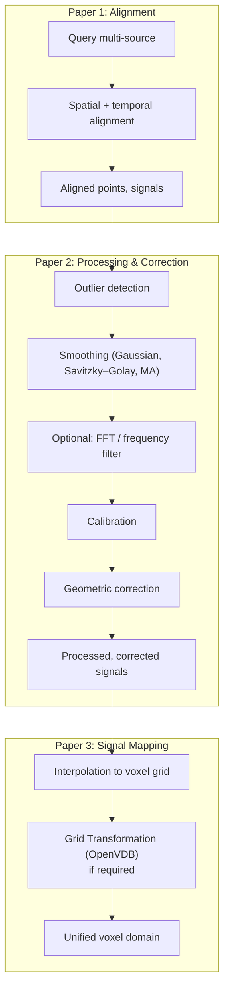
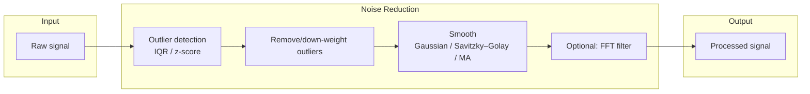
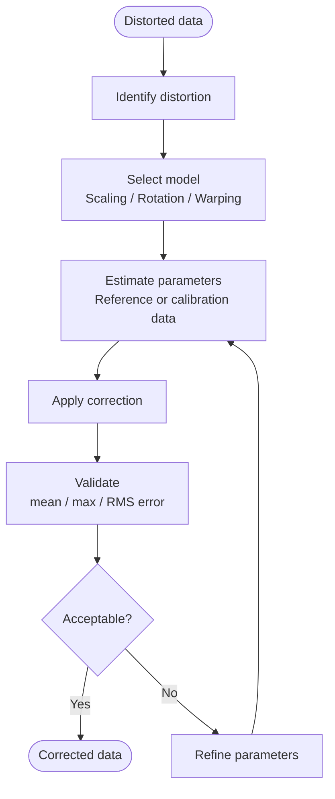

# Design (Methodology)

This section presents the **methodology** for signal processing and correction: pipeline position, noise reduction and filtering, calibration, geometric correction, and **Mermaid flowcharts** where applicable.

## Pipeline Position

Processing and correction sit **after** spatial and temporal alignment (Paper 1) and **before** (or alongside) signal mapping (Paper 3):

1. **Paper 1**: Align points and time/layer → unified coordinate system and consistent time reference.
2. **Paper 2**: Process and correct signals → noise reduction, calibration, distortion correction.
3. **Paper 3**: Map processed/aligned signals to voxel domain → interpolation, grid generation.

4. **Grid Transformation (if required)**: Optionally, after signal mapping, apply **grid-level transformation** (e.g. OpenVDB resampling to target transform or bounding box) when grid alignment or resampling is needed. This is an optional path for workflows that align or resample already-voxelized grids; the main path is point-first (align points then voxelize).

**Figure 1** illustrates the overall pipeline:

## Noise Reduction and Filtering

### Outlier Detection

- **Methods**: IQR (interquartile range), z-score, modified z-score. Applied to signal values (point-level or time-series) to flag outliers.
- **Use**: Optionally remove or down-weight outliers before smoothing; output is a mask or cleaned signal.

### Smoothing

- **Gaussian**: Convolution with a Gaussian kernel; parameter $\sigma$ controls width. Reduces noise while blurring sharp transitions.
- **Savitzky–Golay**: Polynomial fitting over a sliding window; preserves derivatives better than Gaussian. For a window of size $n$ and polynomial order $p$, the convolution coefficients are computed from the least-squares fit of a polynomial of degree $p$ to $n$ points. **Eigen** is used to form the design matrix and solve for the convolution coefficients (or to apply the filter via matrix-vector product).
- **Moving average**: Uniform window; simple and fast. Special case of Savitzky–Golay with $p=0$.

**Quality metrics**: Signal-to-noise ratio (SNR), residual variance before/after smoothing; used to tune window size and method.

### Frequency-Domain Filtering

- **FFT / inverse FFT**: Transform signal to frequency domain, apply gain/mask, transform back. Used for lowpass, highpass, bandpass when noise is band-limited.
- **Implementation**: C++ `SignalProcessing::fft`, `ifft`, `frequencyFilter` (intended: KFR or FFTW); Python wrappers where exposed.
- **Placement**: Optional step after smoothing when temporal or 1D signals are processed.

**Figure 2** shows the noise-reduction sub-pipeline:

## Calibration

### Reference-Based Calibration

- **Reference measurements**: Ground-truth points or values (e.g. CMM, calibration phantom) used to estimate calibration parameters.
- **Calibration data**: Stored parameters (offsets, scales, rotation, etc.) per sensor or scanner.
- **CalibrationManager**: Registers calibrations by name; applies correction to points or signals using the stored parameters; supports validation (mean/max/RMS error vs reference).

### Validation

- Compare corrected points (or signals) to reference; compute mean error, max error, RMS error. Calibration is accepted when these are below thresholds (e.g. sub-voxel or user-defined).

### Application Stages

- **Pre-mapping** (default): Apply calibration to raw or aligned points/signals before mapping to voxel grid. Ensures mapped values are corrected.
- **Post-mapping / pre-fusion / post-fusion**: Optional; apply when residual errors are detected at a later stage. Paper 3 describes these options; this paper describes the correction models and validation.

## Geometric Correction

### Distortion Models

- **Scaling**: Uniform or per-axis scale factors; corrects scaling drift (e.g. CT scanner).
- **Rotation**: Small rotation correction (e.g. fixture misalignment).
- **Warping**: Non-linear distortion model (e.g. polynomial or B-spline warp) for complex geometric errors.
- **Combined**: Apply scaling, then rotation, then warping (or a configurable order).

### Workflow

1. Identify distortion (e.g. from reference measurements or residual alignment error).
2. Select model (scaling, rotation, warping, combined).
3. Estimate parameters (e.g. from reference point pairs or calibration data).
4. Apply correction to points (and optionally to intensity if model includes it).
5. Validate (mean/max/RMS error); refine parameters if needed.

**Figure 3** shows the correction workflow:

## Data Structures

After processing and correction, the pipeline yields (conceptually):

- **Processed signals**: Smoothed, outlier-cleaned (and optionally frequency-filtered) signal arrays per source.
- **Calibration state**: CalibrationManager with registered calibrations and parameters.
- **Corrected points**: Points (and optionally signals) after geometric correction; same format as aligned data but with distortion removed.
- **Validation metrics**: Mean/max/RMS error per calibration or correction step; pass/fail vs thresholds.

Design details and API are in the repository: `docs/AM_QADF/05-modules/processing.md`, `correction.md`; `docs/AM_QADF/06-api-reference/processing-api.md`, `correction-api.md`.
