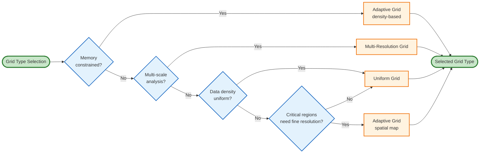
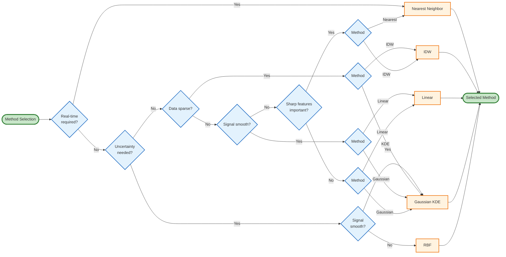

# Methodology

## Signal Mapping Algorithms

Signal mapping is the core transformation that converts heterogeneous point-based data from multiple sources into a unified 3D voxel domain representation. **Calibration and correction are essential prerequisites** that ensure systematic errors, geometric distortions, and sensor biases are removed before mapping, ensuring the accuracy and reliability of mapped signals. Without proper calibration and correction, systematic errors would propagate through all downstream analysis, rendering results unreliable. The mapping process consists of five sequential steps: (1) query raw data with spatial and temporal filters, (2) coordinate system transformation to unify reference frames (with calibration corrections applied), (3) voxel index calculation to map points to voxels, (4) interpolation/aggregation to assign signal values, and (5) signal storage in the voxel grid structure. Additional correction steps can be applied post-mapping or pre/post-fusion to refine accuracy.

### Overview of Signal Mapping Process

Given a set of data points $P = \{p_i = (x_i, y_i, z_i, s_i)\}$ where $(x_i, y_i, z_i)$ are spatial coordinates and $s_i$ are signal values, signal mapping transforms $P$ into a voxel grid $V$ where each voxel $v_{i,j,k}$ contains aggregated signal values. The transformation is defined as:

$$V = \text{SignalMap}(P, G, T, I)$$

where:
- $G$ is the voxel grid structure (bounding box, resolution)
- $T$ is the coordinate transformation matrix
- $I$ is the interpolation method

The complete signal mapping process is illustrated in Figure 1, which shows the five sequential steps from multi-source data input to unified voxel domain output:

```mermaid
flowchart LR
    subgraph Query["Query: Point-Based Data<br/>(Spatial & temporal filters)"]
        P1["Point 1<br/>(x₁, y₁, z₁, value₁)"]
        P2["Point 2<br/>(x₂, y₂, z₂, value₂)"]
        P3["Point N<br/>(xₙ, yₙ, zₙ, valueₙ)"]
    end

    subgraph Process["Signal Mapping Process"]
        Step1["1. Coordinate<br/>Transformation<br/>& Synchronization<br/>Spatial alignment +<br/>Calibration correction"]
        Step2["2. Voxel Index<br/>Calculation<br/>idx = floor((p - min) / res)"]
        Step3["3. Interpolation/<br/>Aggregation<br/>Method: Nearest/Linear/IDW/KDE<br/>Aggregate: mean/max/min/sum"]
        Step4["4. Signal Storage<br/>Store in voxel grid<br/>structure"]
    end

    subgraph Output["Unified Voxel Domain"]
        V1["Voxel [i,j,k]<br/>Signal Value"]
        V2["Voxel [i+1,j,k]<br/>Signal Value"]
        V3["Voxel Grid<br/>Complete 3D Array"]
    end

    P1 --> Step1
    P2 --> Step1
    P3 --> Step1

    Step1 --> Step2
    Step2 --> Step3
    Step3 --> Step4

    Step4 --> V1
    Step4 --> V2
    Step4 --> V3

    classDef query fill:#e3f2fd,stroke:#1976d2
    classDef process fill:#fff3e0,stroke:#f57c00
    classDef output fill:#e8f5e9,stroke:#388e3c

    class P1,P2,P3 query
    class Step1,Step2,Step3,Step4 process
    class V1,V2,V3 output
```

**Note on Timing**: 
- **Query**: Retrieves raw data with spatial and temporal filters from multiple sources (shown as first step)
- **Temporal Synchronization**: Can occur during query (layer-based/time-based filtering) or as part of Step 1 when aligning multi-source data
- **Spatial Synchronization**: Part of Step 1 (Coordinate Transformation), unifying coordinate systems from different sources using transformation matrices
- **Calibration/Correction**: Typically applied **pre-mapping** during Step 1 (most common workflow). Optional corrections can be applied post-mapping, pre-fusion, or post-fusion if residual errors are detected

### Coordinate System Transformation

Different data sources operate in different coordinate systems: build platform coordinates (hatching paths, laser parameters), CT scanner coordinates, and ISPM sensor coordinates. The coordinate system transformation module unifies all data sources to a common reference frame, typically the build platform coordinate system.

#### Transformation Framework

The transformation is performed using a hierarchical coordinate system registry that supports:
- **Translation**: Origin offset between coordinate systems
- **Rotation**: Euler angles (ZYX convention) for axis alignment
- **Scaling**: Uniform or non-uniform scaling factors

For a point $p$ in source coordinate system $S$ with origin $O_S$, rotation matrix $R_S$, and scale $s_S$, the transformation to target system $T$ is:

$$p_T = O_T + s_T \cdot R_T \cdot (R_S^{-1} \cdot (p_S - O_S) / s_S)$$

#### Automatic Alignment

The framework includes automatic alignment algorithms that:
1. **Detect coordinate systems** from metadata in each data source
2. **Extract transformation parameters** (origin, rotation, scale) from STL models, CT scan headers, and ISPM sensor configurations
3. **Calculate transformation matrices** using Umeyama algorithm for point cloud alignment when reference points are available
4. **Validate transformations** by checking that transformed points fall within expected bounding boxes

#### Multi-Source Alignment

For multiple data sources, the framework:
- Uses STL/build platform as the reference coordinate system by default
- Transforms hatching paths (already in build platform coordinates) with identity transformation
- Transforms CT scan coordinates using voxel grid origin and spacing information
- Transforms ISPM sensor coordinates using sensor position and orientation metadata
- Maintains a registry of all coordinate systems and their relationships

### Voxel Grid Generation

The framework supports three types of voxel grids: uniform resolution, adaptive resolution, and multi-resolution grids.

#### Uniform Resolution Grids

Uniform grids use a fixed voxel size $r$ throughout the entire volume. Given a bounding box $[x_{min}, x_{max}] \times [y_{min}, y_{max}] \times [z_{min}, z_{max}]$, the grid dimensions are:

$$d_x = \lceil (x_{max} - x_{min}) / r \rceil$$
$$d_y = \lceil (y_{max} - y_{min}) / r \rceil$$
$$d_z = \lceil (z_{max} - z_{min}) / r \rceil$$

The voxel index $(i, j, k)$ for a point $(x, y, z)$ is calculated as:

$$i = \lfloor (x - x_{min}) / r \rfloor$$
$$j = \lfloor (y - y_{min}) / r \rfloor$$
$$k = \lfloor (z - z_{min}) / r \rfloor$$

#### Adaptive Resolution Grids

Adaptive grids use variable resolution based on data density or spatial importance. The framework supports:
- **Spatial resolution maps**: Different resolutions in different spatial regions (e.g., finer resolution near critical features)
- **Temporal resolution maps**: Different resolutions at different layers or time points
- **Data density-based resolution**: Automatic resolution selection based on local point density

The resolution at point $(x, y, z)$ is determined by:

$$r(x, y, z) = f(\rho(x, y, z), R_{spatial}(x, y, z), R_{temporal}(t))$$

where:
- $\rho(x, y, z)$ is the local data density
- $R_{spatial}(x, y, z)$ is the spatial resolution map
- $R_{temporal}(t)$ is the temporal resolution map

The framework estimates local density using k-nearest neighbors within a radius, then groups points by resolution and creates separate grids for each resolution level.

#### Multi-Resolution Grids

Multi-resolution grids maintain multiple resolution levels simultaneously, enabling level-of-detail (LOD) selection. The framework creates a hierarchy of grids with resolutions:

$$r_l = r_{base} \cdot \alpha^{L-1-l}$$

where:
- $r_{base}$ is the base (finest) resolution
- $\alpha$ is the resolution ratio between levels (typically 2.0)
- $L$ is the number of levels
- $l \in [0, L-1]$ is the level index (0 = coarsest, $L-1$ = finest)

Each point is added to all resolution levels, enabling efficient querying at different scales.

### Grid Type Comparison

Table 2 compares the three grid types supported by the framework:

**Table 2: Comparison of Voxel Grid Types**

| Grid Type | Status | Memory Usage | Query Speed | Resolution Flexibility | Complexity | Best For |
|-----------|--------|--------------|------------|----------------------|------------|----------|
| **Uniform** | ✅ Implemented | High (fixed) | ⭐⭐⭐⭐⭐ | None (fixed resolution) | Low | Consistent data density, simple analysis |
| **Adaptive** | ✅ Implemented | Medium (variable) | ⭐⭐⭐⭐ | High (spatial/temporal) | Medium | Variable data density, memory constraints |
| **Multi-Resolution** | ✅ Implemented | High (multiple levels) | ⭐⭐⭐⭐ | High (LOD selection) | Medium-High | Multi-scale analysis, level-of-detail needs |

**Key Characteristics:**

- **Uniform Grids**: Simplest implementation with fixed voxel size throughout the volume. Memory usage is predictable and querying is fastest due to direct index calculation. However, resolution cannot adapt to local data density, potentially wasting memory in sparse regions or losing detail in dense regions.

- **Adaptive Grids**: Use variable resolution based on data density, spatial importance, or temporal requirements. More memory efficient than uniform grids for non-uniform data distributions. Requires density estimation and region grouping, adding moderate complexity. Querying requires checking which resolution region contains a point.

- **Multi-Resolution Grids**: Maintain multiple resolution levels simultaneously, enabling level-of-detail (LOD) selection for different analysis scales. Highest memory usage but provides maximum flexibility. Each point is stored at all resolution levels, enabling efficient multi-scale queries. More complex to implement and manage.

### Grid Type Selection Criteria

The choice of grid type should be guided by several factors:

#### 1. Data Distribution Characteristics

**Uniform Data Density**:
- Points evenly distributed throughout volume → **Uniform grid** is optimal
- Simple, efficient, predictable memory usage

**Variable Data Density**:
- Dense in some regions, sparse in others → **Adaptive grid** saves memory
- Example: Fine features in critical regions, coarse elsewhere

**Multi-Scale Features**:
- Features at different scales (fine details + coarse trends) → **Multi-resolution grid**
- Enables analysis at appropriate scales

#### 2. Memory Constraints

**Memory Abundant**:
- **Uniform grid**: Simple, fast, predictable
- **Multi-resolution grid**: Maximum flexibility

**Memory Constrained**:
- **Adaptive grid**: Optimizes memory usage based on data density
- **Uniform grid with coarse resolution**: Acceptable if detail loss is acceptable

**Very Memory Constrained**:
- **Adaptive grid with aggressive density-based resolution**: Minimizes memory while preserving important features

#### 3. Analysis Requirements

**Single-Scale Analysis**:
- Fixed resolution needed → **Uniform grid** or **Adaptive grid** with fixed target resolution

**Multi-Scale Analysis**:
- Need to analyze at different resolutions → **Multi-resolution grid**
- Example: Coarse overview + fine detail analysis

**Level-of-Detail (LOD) Visualization**:
- Different resolutions for different zoom levels → **Multi-resolution grid**
- Enables efficient rendering at appropriate detail

**Spatial Feature Analysis**:
- Need fine resolution in specific regions → **Adaptive grid** with spatial resolution maps
- Example: Critical features, defect regions, interfaces

**Temporal Analysis**:
- Different resolutions at different time points/layers → **Adaptive grid** with temporal resolution maps
- Example: Fine resolution during critical build phases

#### 4. Computational Constraints

**Fast Querying Required**:
- **Uniform grid**: Direct index calculation, fastest queries
- **Adaptive grid**: Requires region lookup, slightly slower
- **Multi-resolution grid**: Requires level selection, moderate overhead

**Real-Time Processing**:
- **Uniform grid**: Simplest, fastest
- **Adaptive grid**: Acceptable if region lookup is optimized
- **Multi-resolution grid**: May be too complex for real-time

#### 5. Signal Characteristics

**Smooth Signals** (temperature, density):
- Can use coarser resolution → **Uniform grid** with moderate resolution
- Or **Adaptive grid** with density-based resolution

**Sharp Features** (defects, boundaries):
- Need fine resolution → **Adaptive grid** with fine resolution in feature regions
- Or **Multi-resolution grid** for multi-scale feature detection

**Mixed Characteristics**:
- **Adaptive grid** or **Multi-resolution grid** to handle both

#### 6. Build Characteristics

**Small Builds** (< 100mm):
- **Uniform grid** with fine resolution is feasible
- Memory usage acceptable even at high resolution

**Large Builds** (> 500mm):
- **Adaptive grid** or **Multi-resolution grid** recommended
- Uniform grid at fine resolution may exceed memory limits

**Complex Geometry**:
- Fine features require fine resolution → **Adaptive grid** with feature-based resolution
- Or **Multi-resolution grid** for multi-scale representation

**Simple Geometry**:
- **Uniform grid** is sufficient and simplest

#### Selection Decision Tree

The following flowchart guides the selection of appropriate grid type based on constraints and requirements:

#### Recommended Defaults

For the PBF-LB/M use case, the following defaults are recommended:

- **Small Builds** (< 100mm): **Uniform grid** with resolution 0.1-0.5 mm
- **Medium Builds** (100-500mm): **Adaptive grid** with base resolution 0.5-1.0 mm, fine resolution 0.1-0.2 mm in critical regions
- **Large Builds** (> 500mm): **Adaptive grid** or **Multi-resolution grid** with base resolution 1.0-2.0 mm
- **Multi-Scale Analysis**: **Multi-resolution grid** with 3-4 levels, ratio 2.0
- **Memory Constrained**: **Adaptive grid** with aggressive density-based resolution
- **Real-Time Processing**: **Uniform grid** for simplicity and speed

#### Implementation Considerations

**Uniform Grids**:
- Simplest to implement and debug
- Predictable memory usage: $M = d_x \times d_y \times d_z$ voxels
- Fast queries: O(1) index calculation

**Adaptive Grids**:
- Requires density estimation: O(N·k) for k-nearest neighbors
- Region grouping and grid creation: O(N)
- Query requires region lookup: O(log R) where R is number of regions
- Memory usage: Variable, depends on resolution distribution

**Multi-Resolution Grids**:
- Point addition: O(N·L) where L is number of levels
- Memory usage: $M_{total} = \sum_{l=0}^{L-1} M_l$ where $M_l$ is voxels at level $l$
- Query requires level selection: O(1) after level chosen
- Typically 2-4x memory of single-resolution grid

The framework's flexible design allows users to select appropriate grid types based on their specific requirements, and all three types are fully implemented and available.

### Signal Interpolation

Once points are mapped to voxel indices, signal values must be assigned to voxels. The framework supports multiple interpolation methods.

#### Nearest Neighbor Interpolation

Nearest neighbor assigns each point to its nearest voxel. For a point $p$ at $(x, y, z)$ with signal value $s$, the voxel index $(i, j, k)$ is calculated, and the signal is assigned directly:

$$v_{i,j,k} = s$$

If multiple points map to the same voxel, values are aggregated using mean, median, max, or min aggregation.

#### Linear Interpolation

Linear interpolation computes weighted averages of nearby points using k-nearest neighbors. For a voxel at $(x_v, y_v, z_v)$, the interpolated value is:

$$v_{i,j,k} = \sum_{p \in N} w_p \cdot s_p$$

where $N$ is the set of k nearest points and $w_p$ are weights based on inverse distance. The implementation uses KDTree for efficient neighbor search and supports configurable neighborhood size (default: k=8) and optional radius-based filtering.

#### Inverse Distance Weighting (IDW)

IDW interpolation uses distance-weighted averaging with a power parameter:

$$v_{i,j,k} = \frac{\sum_{p \in N} s_p / d_p^p}{\sum_{p \in N} 1 / d_p^p}$$

where $d_p$ is the distance from point $p$ to the voxel center and $p$ is the power parameter (typically 2.0). The implementation supports configurable power parameter, k-nearest neighbors (default: k=8), and optional radius-based filtering.

#### Gaussian Kernel Density Estimation (KDE)

Gaussian KDE interpolation provides smooth, continuous signal representation by spreading each point's influence according to a Gaussian kernel. For a voxel at $(x_v, y_v, z_v)$, the interpolated value is:

$$v_{i,j,k} = \sum_{p \in N} s_p \cdot K_h(\|p - c_{i,j,k}\|)$$

where $K_h$ is a Gaussian kernel with bandwidth $h$:

$$K_h(d) = \frac{1}{h\sqrt{2\pi}} \exp\left(-\frac{d^2}{2h^2}\right)$$

The implementation supports automatic bandwidth estimation using Silverman's rule of thumb and optional adaptive bandwidth based on local data density. This method provides natural uncertainty quantification through the bandwidth parameter.

#### Radial Basis Functions (RBF)

RBF interpolation provides exact interpolation at data points with smooth interpolation between points. For a voxel at $(x_v, y_v, z_v)$, the interpolated value is:

$$v_{i,j,k} = \sum_{p=1}^{N} w_p \cdot \phi(\|p - c_{i,j,k}\|)$$

where $w_p$ are weights determined by solving a linear system to ensure exact interpolation at data points, and $\phi(r)$ is the radial basis function (kernel). The framework supports multiple kernel types:

- **Gaussian**: $\phi(r) = e^{-(\epsilon r)^2}$ - Smooth, bounded
- **Multiquadric**: $\phi(r) = \sqrt{1 + (\epsilon r)^2}$ - General purpose
- **Inverse Multiquadric**: $\phi(r) = \frac{1}{\sqrt{1 + (\epsilon r)^2}}$ - Smooth, bounded
- **Thin-Plate Spline**: $\phi(r) = r^2 \log(r)$ - Exact interpolation
- **Linear**: $\phi(r) = r$ - Simple, fast
- **Cubic**: $\phi(r) = r^3$ - Smooth
- **Quintic**: $\phi(r) = r^5$ - Very smooth

The implementation supports automatic epsilon parameter estimation based on point distribution, configurable smoothing parameter (0.0 = exact interpolation), and provides warnings for large datasets. The method has O(N³) complexity due to solving a linear system, making it computationally expensive for large datasets. For datasets with N > 10,000 points, consider using the Spark backend or alternative methods (linear, IDW, KDE) for better performance.

#### Hatching Path Interpolation

For hatching paths (polylines), the framework samples points along each path segment at a configurable density (default: 10 points per millimeter). For a path segment from $p_1$ to $p_2$ with signal values $s_1$ and $s_2$, points are sampled at parameter $t \in [0, 1]$:

$$p(t) = p_1 + t \cdot (p_2 - p_1)$$
$$s(t) = s_1 + t \cdot (s_2 - s_1)$$

Sampled points are then interpolated to voxels using nearest neighbor interpolation.

**Hatching Path Signals**: Each hatching path segment carries multiple signal types:
- **Laser parameters**: power, scan speed, energy density
- **Path geometry parameters**: hatch spacing (distance between parallel hatch lines), overlap percentage (overlap between adjacent hatches)
- **Layer parameters**: layer thickness (z-height increment per layer, typically 0.02-0.08 mm for PBF-LB/M), which is critical for build quality, surface finish, and dimensional accuracy
- **Scan strategy parameters**: hatch angle (rotation angle of scan lines, often rotated between layers to reduce anisotropy), pattern type (raster/meander, stripe, chessboard, island strategies), and scan direction. Scan strategy significantly affects residual stress distribution, part distortion, mechanical properties (anisotropy, strength), and build quality
- **Mapping identifier**: `data_index` field that provides one-to-one mapping between each hatching path segment and the corresponding laser parameter measurement that was used to execute that segment, enabling direct comparison between planned process parameters (from hatching paths) and actual measured parameters (from laser sensors)

### Complete Signal Type Catalog

The framework is designed to handle a comprehensive set of signals from all PBF-LB/M data sources. The following catalog lists all possible signals that can be mapped to the voxel domain, including those currently implemented and those that can be added as the framework extends to new data sources:

#### Hatching Path Signals (Complete List)

**Laser Parameters**:
- Power (W) - ✅ Implemented
- Scan speed (mm/s) - ✅ Implemented
- Energy density (J/mm²) - ✅ Implemented
- Exposure time (s) - Available in data structure
- Beam width (mm) - Available in data structure
- Laser focus/spot size (mm) - Framework supports
- Point distance (μm) - Framework supports
- Point exposure time (μs) - Framework supports

**Path Geometry Parameters**:
- Hatch spacing (mm) - ✅ Implemented
- Overlap percentage (%) - ✅ Implemented
- Contour offset (mm) - Framework supports
- Support structure parameters - Framework supports

**Layer Parameters**:
- Layer thickness (mm) - ✅ Implemented
- Layer height (mm) - Framework supports
- Z-position (mm) - Framework supports

**Scan Strategy Parameters**:
- Hatch angle (degrees) - ✅ Implemented
- Pattern type (raster/stripe/chessboard/island) - ✅ Implemented
- Scan direction - ✅ Implemented
- Island size (for island strategies) - Framework supports
- Stripe width (for stripe strategies) - Framework supports
- Rotation increment per layer - Framework supports

**Build Environment Parameters** (can be associated with layers):
- Preheat temperature (°C) - Framework supports
- Build chamber temperature (°C) - Framework supports
- Atmosphere pressure (mbar) - Framework supports
- Atmosphere composition (e.g., Ar, N₂) - Framework supports
- Build platform temperature (°C) - Framework supports

**Mapping and Metadata**:
- `data_index` for one-to-one mapping - ✅ Implemented
- Region type (contour/hatch/support) - Framework supports
- Scan order - Framework supports
- Build style ID - Framework supports

#### Laser Parameter Signals (Complete List)

**Measured Laser Parameters**:
- Laser power (W) - ✅ Implemented
- Scan speed (mm/s) - ✅ Implemented
- Energy density (J/mm²) - ✅ Implemented
- Exposure time (s) - Available in data structure
- Beam width (mm) - Framework supports
- Laser focus position - Framework supports

**Process Context**:
- Region type (contour/hatch/support) - Available in data structure
- `data_index` for one-to-one mapping - ✅ Implemented
- Timestamp - Framework supports
- Layer index - Framework supports

**Derived Parameters** (can be computed):
- Volumetric energy density (J/mm³) - Framework supports
- Linear energy density (J/mm) - Framework supports
- Power density (W/mm²) - Framework supports

#### CT Scan Signals (Complete List)

**Material Properties**:
- Density (g/cm³) - ✅ Implemented
- Porosity (0-1) - ✅ Implemented
- Hounsfield units (HU) - Framework supports
- Material phase information - Framework supports

**Defect Information**:
- Defect map (binary) - ✅ Implemented
- Defect locations (coordinates) - ✅ Implemented
- Defect type classification - Framework supports
- Defect size/volume - Framework supports
- Defect severity/confidence - Framework supports

**Geometric Properties** (can be derived):
- Wall thickness - Framework supports
- Surface roughness (if derived from CT) - Framework supports
- Grain structure/orientation - Framework supports
- Pore connectivity - Framework supports

**Quality Metrics** (can be computed):
- Relative density - Framework supports
- Pore size distribution - Framework supports
- Defect density - Framework supports

#### ISPM Monitoring Signals (Complete List)

**Thermal Signals**:
- Melt pool temperature (°C) - ✅ Implemented
- Peak temperature (°C) - ✅ Implemented
- Cooling rate (K/s) - ✅ Implemented
- Temperature gradient (K/mm) - ✅ Implemented
- Solidification rate (mm/s) - Framework supports
- Thermal history - Framework supports

**Melt Pool Characteristics**:
- Melt pool size (width, length, depth in mm) - ✅ Implemented
- Melt pool geometry (aspect ratio, shape factors) - Framework supports
- Melt pool position (x, y, z) - Framework supports
- Melt pool velocity - Framework supports

**Process Events**:
- Process events (layer_start, hatch_complete, etc.) - ✅ Implemented
- Anomaly flags - Framework supports
- Quality indicators - Framework supports

**Sensor Metadata**:
- Sensor ID - Framework supports
- Measurement uncertainty - Framework supports
- Sensor position/orientation - Framework supports
- Sampling rate - Framework supports

**Derived Thermal Metrics** (can be computed):
- Heat input rate - Framework supports
- Thermal cycles - Framework supports
- Cooling time - Framework supports

### Framework Extensibility

The framework's signal mapping architecture is designed to be extensible. New signal types can be added by:
1. **Extending SignalType enum**: Add new signal types to the base query client
2. **Implementing signal extraction**: Add signal extraction logic in query clients
3. **Configuring interpolation**: Select appropriate interpolation method for new signal characteristics
4. **Storage in voxel grid**: The voxel grid structure supports arbitrary signal types per voxel

This extensibility ensures the framework can accommodate future data sources and signal types as PBF-LB/M monitoring capabilities evolve.

### Interpolation Method Comparison

Table 1 compares the interpolation methods implemented in the framework:

**Table 1: Comparison of Signal Interpolation Methods**

| Method | Status | Complexity | Smoothness | Sparse Data | Uncertainty | Parameters | Best For |
|--------|--------|------------|------------|-------------|-------------|------------|----------|
| **Nearest Neighbor** | ✅ Implemented | O(N) | Low (discontinuous) | Poor | No | None | Dense data, fast processing |
| **Linear** | ✅ Implemented | O(N·k) | Medium | Medium | No | Neighborhood size (k) | Moderate density, smooth signals |
| **IDW** | ✅ Implemented | O(N·k) | Medium-High | Good | No | Power parameter (p), k | Sparse data, distance-weighted |
| **Gaussian KDE** | ✅ Implemented | O(N·M) | High | Excellent | Yes | Bandwidth (h), adaptive | Smooth signals, uncertainty needed |
| **RBF** | ✅ Implemented | O(N³) | Very High | Excellent | No | RBF type, shape parameter | High accuracy, exact interpolation |

*Legend: ✅ = Implemented, 🔄 = Planned/Future, N = number of points, M = number of voxels, k = neighborhood size*

**Key Characteristics:**

- **Nearest Neighbor**: Fastest method, suitable for dense point clouds where each voxel receives multiple points. Creates step-like discontinuities but requires no parameter tuning.

- **Linear Interpolation**: Provides smoother results by averaging nearby points using k-nearest neighbors (default: k=8). Supports optional radius-based filtering. Moderate computational cost with efficient KDTree-based neighbor search.

- **Inverse Distance Weighting (IDW)**: Distance-weighted averaging that gives more weight to closer points. Handles sparse data better than nearest neighbor. Supports configurable power parameter (default: p=2.0) and k-nearest neighbors (default: k=8). Provides smooth interpolation suitable for sparse point clouds.

- **Gaussian Kernel Density Estimation (KDE)**: Provides smooth, continuous interpolation with natural uncertainty quantification through bandwidth parameter. Supports automatic bandwidth estimation (Silverman's rule) and adaptive bandwidth based on local data density. Higher computational cost (O(N·M)) but excellent for smooth signals like temperature or density.

- **Radial Basis Functions (RBF)**: Provides exact interpolation at data points with smooth interpolation between. Highest accuracy but requires solving linear system (O(N³)), making it computationally expensive for large datasets. Supports multiple kernel types (Gaussian, multiquadric, thin-plate spline, etc.) with automatic epsilon parameter estimation. Recommended for high-accuracy requirements and exact interpolation needs. For large datasets (N > 10,000), consider using Spark backend or alternative methods for better performance.

### Method Selection Criteria

The choice of interpolation method should be guided by several factors:

#### 1. Data Characteristics

**Point Density**:
- **Dense data** (>10 points per voxel): Nearest neighbor or linear interpolation are sufficient
- **Sparse data** (<1 point per voxel): IDW or Gaussian KDE provide better coverage
- **Variable density**: Adaptive methods or Gaussian KDE with adaptive bandwidth

**Signal Smoothness**:
- **Smooth signals** (temperature, density): Gaussian KDE or linear interpolation preserve smoothness
- **Sharp features** (defect boundaries, material interfaces): Nearest neighbor or IDW preserve discontinuities
- **Mixed characteristics**: Consider hybrid approaches or signal-specific method selection

#### 2. Computational Constraints

**Real-Time Processing**:
- Nearest neighbor: O(N) - suitable for real-time
- Linear/IDW: O(N·k) - acceptable for moderate datasets
- Gaussian KDE: O(N·M) - may be too slow for real-time
- RBF: O(N³) - not suitable for real-time

**Memory Constraints**:
- Nearest neighbor: Minimal (sparse storage)
- Linear/IDW: Moderate (neighborhood search structures)
- Gaussian KDE: Higher (kernel evaluations)
- RBF: High (full matrix storage)

#### 3. Accuracy Requirements

**High Accuracy Needed**:
- RBF provides exact interpolation at data points
- Gaussian KDE provides smooth, continuous interpolation
- Linear/IDW provide good approximation

**Approximation Acceptable**:
- Nearest neighbor provides reasonable accuracy for dense data
- Linear interpolation provides good balance of accuracy and speed

#### 4. Uncertainty Quantification

**Uncertainty Required**:
- Gaussian KDE: Natural uncertainty through bandwidth parameter
- RBF: Can provide uncertainty estimates
- Nearest neighbor: Can track point count per voxel as proxy

**Uncertainty Not Required**:
- Nearest neighbor, linear, or IDW are sufficient

#### 5. Signal Type Considerations

**ISPM Monitoring Signals**:
- **Melt pool temperature**: Smooth, continuous → Gaussian KDE or linear interpolation
- **Peak temperature**: Smooth, continuous → Gaussian KDE or linear interpolation
- **Cooling rate**: Temporal derivative signal → Linear interpolation with temporal smoothing
- **Temperature gradient**: Spatial derivative signal → Linear or Gaussian KDE interpolation
- **Melt pool size** (width, length, depth): Geometric measurements → Nearest neighbor or IDW
- **Process events**: Discrete categorical data → Nearest neighbor (preserve event labels)
- Temporal correlation → Consider temporal smoothing for thermal signals

**Laser Parameters (Power, Speed)**:
- May have sharp transitions → Nearest neighbor or IDW
- Dense along paths → Nearest neighbor sufficient

**CT Scan Data**:
- Already voxelized → Direct assignment or nearest neighbor
- High resolution → Preserve sharp features
- **Density values**: Continuous material density (g/cm³) → Direct assignment or nearest neighbor (already voxelized)
- **Porosity map**: Continuous porosity values (0-1) → Direct assignment or nearest neighbor
- **Defect map**: Binary defect map (0=normal, 1=defect) → Direct assignment (preserve binary values)
- **Defect locations**: Discrete defect coordinates → Nearest neighbor or direct assignment
- Defect information is critical for quality assessment and correlation with process parameters

**Hatching Paths**:
- Polylines with dense sampling → Nearest neighbor after path sampling
- Path-based interpolation → Linear interpolation along segments
- Signals include: laser power, scan speed, energy density, hatch spacing, overlap percentage, layer thickness, and scan strategy parameters (hatch angle, pattern type, scan direction)
- Each hatching path segment has a `data_index` that provides one-to-one mapping to the corresponding laser parameter measurement that was used to execute that segment, enabling direct comparison between planned parameters (hatching) and actual measured parameters (laser)
- Layer thickness is a critical process parameter that affects build quality, surface finish, and dimensional accuracy, typically ranging from 0.02-0.08 mm for PBF-LB/M processes
- Scan strategy (hatch angle rotation, pattern type) is critical for controlling residual stress, part distortion, and mechanical properties, with hatch angles often rotated between layers (e.g., 67° or 90° increments) to reduce anisotropy

#### 6. Downstream Analysis Requirements

**Spatial Derivatives Needed**:
- Smooth interpolation (Gaussian KDE, linear) enables derivative computation
- Nearest neighbor creates discontinuities that complicate derivatives

**Anomaly Detection**:
- Smooth interpolation may hide sharp anomalies → Nearest neighbor or IDW
- Uncertainty quantification helps → Gaussian KDE

**Statistical Analysis**:
- Any method acceptable, but smooth interpolation provides better correlation analysis

**Visualization**:
- Smooth interpolation (Gaussian KDE, linear) provides better visualizations
- Nearest neighbor may show artifacts

#### Selection Decision Tree

The following flowchart guides the selection of appropriate interpolation method based on processing requirements, data characteristics, and analysis needs:

#### Recommended Defaults

For the PBF-LB/M use case, the following defaults are recommended:

- **Hatching Paths**: Nearest neighbor (dense along paths, path-based sampling). Signals include power, speed, energy, hatch spacing, overlap percentage, layer thickness, and scan strategy parameters (hatch angle, pattern type). The `data_index` field enables one-to-one mapping between hatching path segments and the corresponding laser parameter measurements that were used to execute those segments. Layer thickness and scan strategy parameters are stored at the layer level and mapped to all points within that layer.
- **Laser Parameters**: Nearest neighbor or IDW (may have sharp transitions)
- **CT Scans**: Direct assignment or nearest neighbor (already voxelized). Signals include density (g/cm³), porosity (0-1), defect map (binary), and defect locations. Since CT data is already voxelized, direct assignment is most efficient, preserving the original voxel structure and defect information.
- **ISPM Monitoring**: Multiple signal types - melt pool temperature and peak temperature use Gaussian KDE or linear (smooth, continuous), cooling rate and temperature gradient use linear with temporal smoothing, melt pool size uses nearest neighbor or IDW, process events use nearest neighbor (preserve discrete labels)
- **General Purpose**: Nearest neighbor for speed, IDW for sparse data, Gaussian KDE for smooth signals

The framework's extensible design allows users to select appropriate methods based on their specific requirements. Five interpolation methods are currently implemented (Nearest Neighbor, Linear, IDW, Gaussian KDE, RBF), providing a comprehensive range of interpolation capabilities from fast approximation to exact interpolation.

### Data Synchronization

Data synchronization ensures temporal and spatial alignment of data from different sources that may have different sampling rates, temporal offsets, or coordinate systems.

#### Temporal Synchronization

Temporal synchronization aligns data across different time scales:

**Layer-Based Alignment**: Data is aligned by build layer index. The framework maintains a mapping between timestamps and layer indices using a `LayerTimeMapper` that:
- Maps layer indices to z-heights using layer height information
- Maps z-heights to timestamps using build speed information
- Interpolates timestamps for layers using linear interpolation

**Time-Based Alignment**: For time-series data (e.g., ISPM monitoring), the framework:
- Sorts time points by timestamp
- Interpolates values to target time points using linear or nearest neighbor interpolation
- Handles missing data by forward-fill or backward-fill strategies

**Temporal Interpolation**: When aligning to specific layers or time points, the framework uses interpolation methods:
- **Nearest**: Uses the closest time point
- **Linear**: Linear interpolation between adjacent time points
- **Zero-order hold**: Uses the previous value until the next time point

#### Spatial Synchronization

Spatial synchronization ensures coordinate system alignment (covered in Coordinate System Transformation section) and handles:
- **Point cloud alignment**: Aligning point clouds from different sensors using iterative closest point (ICP) or Umeyama algorithm
- **Grid alignment**: Ensuring voxel grids from different sources align to the same grid structure
- **Registration validation**: Verifying alignment accuracy by checking overlap and correspondence

#### Signal Synchronization

Signal synchronization handles:
- **Multiple signals per voxel**: Each voxel can store multiple signal types (hatching, laser, CT, ISPM) simultaneously
- **Signal aggregation**: When multiple points map to the same voxel, signals are aggregated using configurable methods (mean, median, max, min, sum)
- **Signal fusion**: Quality-based fusion of signals from multiple sources (covered in Analysis Framework paper)

### Calibration and Correction

**Critical Importance**: Calibration and correction are essential components of the signal mapping framework. Without proper calibration and correction, systematic errors, biases, and geometric distortions would propagate through the mapping process, rendering downstream analysis unreliable. The framework provides comprehensive calibration and correction capabilities that can be applied flexibly at different stages (typically pre-mapping, with optional post-mapping, pre-fusion, or post-fusion corrections as needed) depending on where errors are detected and what type of correction is needed.

#### Calibration Framework

The framework includes a **CalibrationManager** that manages calibration data for multiple coordinate systems and sensors:

**Reference Measurements**: Ground truth measurements from calibrated sources (CMM, CT scans, reference artifacts) are used to establish calibration parameters. Each reference measurement includes:
- Measured point coordinates
- Expected (true) point coordinates
- Measurement uncertainty
- Measurement type (manual, CT scan, CMM, etc.)

**Calibration Data**: Stores calibration parameters including:
- Transformation matrices (4×4 homogeneous transformation)
- Distortion parameters
- Calibration uncertainty metrics
- Calibration date and metadata

**Calibration Validation**: The framework computes calibration error metrics (mean error, max error, RMS error) and validates calibration quality against thresholds.

#### Geometric Distortion Correction

The framework supports multiple geometric distortion models that can be applied individually or in combination:

**Scaling Distortion Correction**: Corrects non-uniform scaling errors (e.g., CT scanner scaling drift, sensor calibration drift) using scale factors per axis.

**Rotation Distortion Correction**: Corrects rotational misalignments using rotation matrices derived from reference measurements.

**Warping Distortion Correction**: Corrects non-linear geometric distortions using displacement fields or thin-plate spline interpolation based on reference point correspondences.

**Combined Distortion Correction**: Applies multiple distortion models in sequence to handle complex distortion patterns.

#### Correction Application Workflow

The framework provides flexibility to apply corrections at different stages depending on the use case and error sources. **Not all stages are always necessary**—the choice depends on where errors are detected and what type of correction is needed:

1. **Pre-Mapping Correction** (Most Common): Apply calibration corrections to raw point data before mapping to voxel domain
   - Corrects coordinate system errors and systematic biases at the source
   - Ensures accurate spatial registration before interpolation
   - **Recommended**: Apply geometric corrections (scaling, rotation, warping) at this stage to prevent error propagation

2. **Post-Mapping Correction** (Optional): Apply corrections to mapped voxel grids if residual errors are detected after mapping
   - Corrects residual alignment errors that may arise from interpolation
   - Adjusts for mapping artifacts
   - **Use when**: Pre-mapping correction was insufficient or errors are detected post-mapping

3. **Pre-Fusion Correction** (Optional): Apply signal-specific corrections before fusion when combining multiple signal sources
   - Normalizes signal scales across different sensors
   - Removes sensor-specific biases
   - Aligns signal ranges for meaningful fusion
   - **Use when**: Fusing signals from different sensors with different scales or biases

4. **Post-Fusion Correction** (Rare): Apply corrections to fused signals only if fusion artifacts are detected
   - Refines fused signal accuracy
   - Corrects fusion-specific artifacts
   - **Use when**: Fusion process introduces errors that need correction

**Typical Workflow**: Most use cases require only **pre-mapping correction** to ensure accurate coordinates before mapping. Additional correction stages are applied only when specific errors are identified at those stages.

#### Correction Validation

The framework includes a **CorrectionValidator** that:
- Computes alignment errors between corrected and reference points
- Assesses correction quality (excellent, good, acceptable, poor)
- Compares multiple correction methods
- Validates improvement from correction (before vs. after metrics)

**Validation Metrics**:
- Mean alignment error
- Maximum alignment error
- RMS (root mean square) error
- Error distribution statistics

### Noise and Distortion Handling

The framework includes modules for handling noise and random errors:

**Outlier Detection**: Statistical methods (Z-score, IQR) identify and remove outliers from point data before mapping.

**Signal Smoothing**: Spatial and temporal smoothing filters reduce noise while preserving signal characteristics.

**Quality-Based Filtering**: Points with low quality scores (based on SNR, completeness, alignment accuracy) are filtered or weighted lower during aggregation.

**Note**: Systematic errors and geometric distortions are handled by the Calibration and Correction framework described above, which is distinct from noise handling and addresses systematic biases rather than random noise.

### Algorithm Complexity

For $N$ data points and a voxel grid with $M$ voxels:
- **Coordinate transformation**: $O(N)$ - linear in number of points
- **Voxel index calculation**: $O(N)$ - constant time per point
- **Nearest neighbor interpolation**: $O(N)$ - direct assignment
- **Aggregation**: $O(N)$ - linear scan through points
- **Overall complexity**: $O(N)$ for uniform grids

For adaptive and multi-resolution grids, complexity depends on the number of resolution levels and regions, but remains linear in the number of points for typical use cases.

