# AM-QADF Publications Repository

**Private Git Repository for Research Publications and Documentation**

This repository contains all research publications, posters, and supporting documentation for the AM-QADF (Additive Manufacturing Quality Assessment and Data Fusion) framework project.

**What’s inside:** Five research papers (foundation → signal mapping → analysis → industrial application), conference posters, flowcharts, and narratives. Each paper folder has a README, abstract, sections, and key files—start from the overview below and open the paper that interests you.

## 📋 Repository Overview

This is a **private Git repository** dedicated to managing research publications, including:
- **Research Papers** (Paper1, Paper2, Paper3, Paper4, Paper5)
- **Conference Posters** (Poster1, Poster2, Poster3)
- **Supporting Documentation** (flowcharts, narratives, planning documents)
- **Narrative Explanations** (detailed module descriptions for supervisor presentations)

## 📁 Repository Structure

```
publications/
├── Paper1/              # Spatial and Temporal Synchronization (Foundation)
├── Paper2/              # Signal Processing and Correction (Foundation for Mapping)
├── Paper3/              # Signal Mapping Framework Paper
├── Paper4/              # Analysis Capabilities Paper
├── Paper5/              # Framework Application Paper
├── Poster1/             # Signal Mapping Framework Poster
├── Poster2/             # Analysis Capabilities Poster
├── Poster3/             # Framework Application Poster
├── flowchart_images/     # Mermaid diagrams and PNG images
├── plots/               # Generated plots and figures
├── Publication_Narrative.md  # Overall research narrative
└── Poster_Planning.md   # Poster planning and design notes
```

## 📄 Papers

Brief overview of each paper. Open the linked folder or README for full structure, sections, and narratives.

---

### Paper 1: Spatial and Temporal Synchronization (Foundation)
**Title**: Spatial and Temporal Synchronization for Multi-Source PBF-LB/M Data: Design, Rationale, and Implementation  
**Target Venue**: To be determined (foundation; may be submitted to Additive Manufacturing, Journal of Manufacturing Systems, or a conference)  
**Status**: In progress — structure complete; content to be refined with experimental results

**What it’s about:** Why and how we align multi-source PBF-LB/M data *before* any analysis. Defines a **point-first pipeline** (transform points then voxelize), **spatial alignment** from bounding-box corners only (no point-to-point correspondence), and **temporal alignment** by layer/time so that “same location” and “same layer” are well-defined across hatching, laser, ISPM, and CT.

**Why read it:** Foundation for Papers 3–5; without a common coordinate system and time/layer reference, signal mapping and analysis are ill-defined. This paper gives the full algorithm (bbox-corner, 24×56 fits, Kabsch+Umeyama, validation) and why we prefer it over grid-based alignment or RANSAC/point matching.

**Pipeline (point-first):**

```mermaid
flowchart LR
    A[1. Query] --> B[2. Bbox 8 corners] --> C[3. Fit 24×56 Kabsch+Umeyama] --> D[4. Select min max err] --> E[5. Validate τ] --> F[6. Transform] --> G[7. Temporal] --> H[Output]
```



*Details:* Query (optional layer/bbox for output); fit = 24 permutations × 56 triplets, Kabsch (rotation) + Umeyama (scale, translation); validate with τ = max(0.01×L_max, 1e−3, τ_user); then transform; optional bin by layer/time.

**Spatial alignment (bbox-corner only):**

| Aspect | Description |
|--------|-------------|
| **Assumption** | Sources share the **same physical bounding-box extent** (same size box in different frames). No point-to-point correspondence between raw data. |
| **Input** | 8 bbox corners per source (from full extent by default). **24 rotational permutations** of the cube (vertex index permutations) × **56 triplets** C(8,3) to try. |
| **Fit** | For each (permutation, triplet): **Kabsch** gives optimal rotation **R** from 3 source → 3 reordered reference corners (SVD of **P**_c^T **Q**_c); **Umeyama** gives scale *s* and translation **t**. Similarity **T** = [*s* **R** \| **t**]. |
| **Quality** | Apply **T** to all 8 source corners; compare to reordered reference; compute max, mean, RMS error. |
| **Selection** | Choose (permutation, triplet) with **smallest max_error**; return **T** and **best_ref_corners**. |
| **Validation** | Compare **T**×source_corners to **best_ref_corners** (not raw reference order). Pass when max_error ≤ τ and rms_error ≤ τ. |

**Temporal alignment (optional):** **LayerTimeMapper** maps time ↔ layer; points are **binned by layer** (or time window) so that “same layer” is well-defined across sources. **Point-based** (no grid resampling); output: indices per layer per source for slicing.

**Why our algorithm:** **Point-first** avoids grid resampling and preserves precision; **bbox-corner only** avoids the ill-posed correspondence problem (no RANSAC or raw point matching); **full extent by default** gives a single stable transform; **best_ref_corners** and **adaptive tolerance** keep validation consistent with the fit.

**Full detail:** [`Paper1/Design.md`](Paper1/Design.md) (equations, flowcharts, validation), [`Paper1/Why_Our_Algorithm.md`](Paper1/Why_Our_Algorithm.md) (point-first vs grid-based, bbox vs RANSAC). Main repo: `implementation_plan/new/SPATIAL_ALIGNMENT_DESIGN.md`, `Temporal_Alignment_Design.md`, `docs/AM_QADF/05-modules/synchronization.md`, `06-api-reference/synchronization-api.md`.

**Location**: [`Paper1/`](Paper1/)

### Paper 2: Signal Processing and Correction (Foundation for Mapping)
**Title**: Signal Processing and Correction for Multi-Source PBF-LB/M Data: Noise Reduction, Calibration, and Pre-Mapping Quality  
**Target Venue**: To be determined (foundation; may be submitted with Paper 1/3 or to a signal processing / AM venue)  
**Status**: In progress — structure complete; content to be refined with experimental results

**What it’s about:** *What* values to use before mapping: the pipeline step between Paper 1 (alignment) and Paper 3 (signal mapping). Covers **noise reduction** (outlier detection, smoothing, FFT), **calibration** (reference-based, CalibrationManager), and **geometric distortion correction** (scaling, rotation, warping). Justifies **Eigen** (linear algebra) and **KFR** (FFT, filters).

**Why read it:** Raw signals are noisy and can have systematic errors; this paper defines the algorithms and library choices so that the data fed into the voxel domain is reliable and traceable (SNR, calibration error, correction residual).

**Pipeline position:**


**Noise reduction and filtering:**

| Component | Methods | Description | When to use |
|-----------|---------|-------------|-------------|
| **Outlier detection** | IQR, z-score, modified z-score | Flag or remove outliers at point or time-series level; output mask or cleaned signal. | Before smoothing when spikes or sensor glitches are present. |
| **Smoothing** | **Gaussian** (σ), **Savitzky–Golay** (window, polynomial order), **Moving average** (window) | Gaussian: convolution kernel, blurs sharp edges. Savitzky–Golay: polynomial fit over sliding window, better derivative preservation; **Eigen** builds design matrix and convolution coefficients. MA: uniform window (Savitzky–Golay with order 0). | Gaussian for simple blur; Savitzky–Golay when derivatives matter; MA for speed. Tune via SNR / residual variance. |
| **Frequency-domain** | FFT, inverse FFT, lowpass / highpass / bandpass | Transform to frequency domain, apply gain/mask, transform back. **KFR** (or FFTW) for FFT and filters. | When noise is band-limited (e.g. high-frequency noise → lowpass). |

**Calibration:** **Reference-based calibration** using ground-truth (e.g. CMM, calibration phantom). **CalibrationManager** stores parameters (offsets, scales, rotation) per sensor/scanner and applies correction. **Validation:** mean/max/RMS error vs reference; accept when below thresholds (e.g. sub-voxel). **Application stages:** **pre-mapping** (default); optional **post-mapping**, **pre-fusion**, or **post-fusion** when residual errors are found later.

**Geometric correction:** **Distortion models:** **Scaling** (uniform or per-axis, e.g. CT drift), **rotation** (e.g. fixture misalignment), **warping** (non-linear: polynomial or B-spline for complex distortion), **combined** (scaling → rotation → warping). **Workflow:** identify distortion → select model → estimate parameters (e.g. from reference point pairs) → apply to points (and optionally intensity) → **validate** (mean/max/RMS); refine if needed.

**Library roles:** **Eigen**: Savitzky–Golay (convolution matrix / design matrix), RBF systems (shared with signal mapping), calibration least-squares. **KFR**: FFT, inverse FFT, FIR/IIR filters; SIMD-optimized. (Eigen header-only; KFR in third_party, enable in build for full FFT/filter support.)

**Full detail:** [`Paper2/Design.md`](Paper2/Design.md) (flowcharts, formulas, workflow), [`Paper2/Why_Eigen_and_KFR.md`](Paper2/Why_Eigen_and_KFR.md), [`Paper2/Tables.md`](Paper2/Tables.md). Main repo: `implementation_plan/new/SIGNAL_PROCESSING_LIBRARIES.md`; `docs/AM_QADF/05-modules/processing.md`, `correction.md`; `docs/Infrastructure/third-party/eigen.md`, `kfr.md`.

**Location**: [`Paper2/`](Paper2/)

### Paper 3: Signal Mapping Framework
**Title**: Unified Voxel Domain Signal Mapping for Multi-Source PBF-LB/M Process Data  
**Target Venue**: Additive Manufacturing (Elsevier)  
**Status**: ✅ Complete - Ready for Review

**What it’s about:** *Where* to put signals: mapping aligned, corrected data onto a unified voxel domain, plus **quality assessment** and **data fusion**. Presents the core signal mapping framework (5-step pipeline below), NoSQL data warehouse design, **Quality Assessment Module** (completeness, SNR, alignment accuracy), and **Data Fusion Module** (quality-weighted combination of multiple signals in the voxel domain).

**Why read it:** Defines the five-step mapping pipeline and the five interpolation methods (nearest, linear, IDW, KDE, RBF) with formulas, grid types (uniform, adaptive, multi-resolution), and when to use each—so implementers and reviewers see the algorithms in one place.

**Signal mapping + fusion:** Paper 3 covers (i) **signal mapping** (5 steps: point data → voxel grid) and (ii) **data fusion** (combine multiple mapped signals per voxel with quality-based weighting). Flowchart below is the mapping pipeline; fusion operates on the stored grids.


*Step 4:* Nearest, Linear, IDW, KDE, or RBF; aggregation = mean/max/min/sum when multiple points per voxel. *Fusion:* quality-weighted combination of multiple signals (see [`data-fusion.md`](Paper3/data-fusion.md)).

**Interpolation algorithms** (step 4):

| Method | Description | When to use |
|--------|-------------|-------------|
| **Nearest neighbor** | Assign each point to its nearest voxel; aggregate (mean/max/min) if multiple points per voxel. | Fast, preserves local structure; good for dense or discrete signals. |
| **Linear** | Weighted average of **k-nearest neighbors** (default k=8) with inverse-distance weights. Uses KDTree for neighbor search; optional radius filter. | Smooth, continuous signals. |
| **IDW** (Inverse Distance Weighting) | Distance-weighted average: *v* = Σ(*s*_p/*d*_p^p) / Σ(1/*d*_p^p); power *p* typically 2.0. Configurable k-NN and radius. | Distance-weighted smoothing; tunable influence. |
| **Gaussian KDE** | Weighted sum with Gaussian kernel *K*_h(‖*p* − *c*‖); bandwidth *h* via Silverman’s rule or adaptive. | Smooth, continuous field; natural uncertainty via bandwidth. |
| **RBF** (Radial Basis Functions) | *v* = Σ *w*_p φ(‖*p* − *c*‖); weights from linear system for **exact interpolation at data points**. Kernels: Gaussian, multiquadric, inverse multiquadric, thin-plate spline, linear, cubic, quintic. | Exact at samples, smooth elsewhere; best for smaller N (O(N³) solve). |

**Grid types:** **Uniform** (fixed voxel size, O(1) index); **adaptive** (resolution by data density, k-NN density estimation); **multi-resolution** (multiple levels, e.g. ratio 2.0). Hatching paths can be sampled along segments (e.g. 10 pts/mm) then mapped with nearest neighbor.

**Key contributions:** Signal mapping framework (above algorithms + grid types); NoSQL data warehouse architecture; Quality Assessment Module; Data Fusion Module.

**Full detail:** Formulas, decision trees, and implementation notes are in [`Paper3/Methodology.md`](Paper3/Methodology.md). See also [`Paper3/README.md`](Paper3/README.md), [`quality-assessment.md`](Paper3/quality-assessment.md), [`data-fusion.md`](Paper3/data-fusion.md).

**Location**: [`Paper3/`](Paper3/)

---

### Paper 4: Analysis Capabilities
**Title**: Comprehensive Analysis Framework for Multi-Source PBF-LB/M Data: Sensitivity Analysis, Virtual Experiments, and Anomaly Detection  
**Target Venue**: Journal of Manufacturing Systems (Elsevier)  
**Status**: ✅ Complete - Ready for Review and Refinement

**What it’s about:** What you can *do* with the unified voxel domain (from Paper 3): **sensitivity analysis** (which inputs drive outputs), **virtual experiment design** (systematic parameter exploration), **anomaly detection** (unusual patterns, quality issues), and **multi-signal fusion** (quality-weighted combination). All methods integrate with the NoSQL warehouse; analysis runs on mapped voxel data and process variables. Includes **7 interactive Jupyter notebooks** with widget-based workflows.

**Why read it:** Defines the full set of analysis methods (12 sensitivity, 10 experiment designs, 18+ anomaly detectors), when to use each, formulas and sample-size guidance, and how they connect to the warehouse and voxel domain—so implementers and reviewers see the analysis stack in one place.

**Sensitivity analysis (12 methods):** Identifies which process variables most influence quality/measurement. **Global:** Sobol (variance decomposition, first/total/second-order indices; 1k–10k samples; interactions), Morris (elementary effects, screening; ~10–20×(n+1); fast screening), FAST (Fourier-based; 65–1k samples; first-order), RBD (random balance; N samples for N params; preliminary), Delta (moment-independent; full distribution; 1k–5k), PAWN (CDF-based; non-linear), DGSM (derivative-based; gradients). **Local:** Local derivatives (n+1 or 2n+1 evals; operating point), Local perturbation, Local central differences. **Uncertainty:** Monte Carlo (1k–10k; uncertainty propagation), Bayesian (posterior; prior knowledge). **Use case:** MPM system sensitivity—how process variables and events affect measurement accuracy and signal quality.

**Virtual experiment design (10 types):** **Basic:** LHS (space-filling, 50–500 samples; exploration, surrogates), Random sampling, Parameter sweep (1–2 params, visualization). **Factorial:** Full factorial 2^k (all combinations; k ≤ 5), Full factorial 3^k (quadratic effects; k ≤ 4). **Response surface:** Central Composite (CCD; 2^k + 2k + center; quadratic, 3–6 factors), Box-Behnken (no corners; 3–7 factors). **Optimal:** D-optimal (max det(X'X); constrained spaces), A-optimal (min trace), G-optimal (min max prediction variance).

**Anomaly detection (18+ methods):** **Statistical:** Z-score, IQR (robust), Mahalanobis (multivariate), Modified Z-score (MAD), Grubbs (single outlier test). **Clustering:** DBSCAN (density; irregular shapes), Isolation Forest (tree-based; scalable), LOF (local density), One-Class SVM (kernel), K-Means (distance to centers). **ML-based:** Autoencoder (reconstruction error), LSTM Autoencoder (temporal), VAE (probabilistic). **Rule-based:** Threshold violation, Pattern deviation (SPC), Temporal pattern, Spatial pattern (voxel), Multi-signal correlation. Enables spatial anomaly localization at voxel level.

**Warehouse integration:** Direct query of process variables and measurement outputs; automatic parameter range extraction from historical builds; results storage and querying for reproducibility. **Voxel-domain analysis:** Spatial-temporal analysis, multi-signal correlation at same locations, quality-based fusion (per-voxel quality scores).

**Full detail:** [`Paper4/Analysis_Capabilities.md`](Paper4/Analysis_Capabilities.md) (formulas, method comparison tables, selection criteria), [`Paper4/Integration_with_Warehouse.md`](Paper4/Integration_with_Warehouse.md), [`Paper4/Case_Studies.md`](Paper4/Case_Studies.md) (5 case studies, incl. MPM sensitivity and PBF-LB/M system/VM experiments). [`Paper4/README.md`](Paper4/README.md) for full section list.

**Location**: [`Paper4/`](Paper4/)

---

### Paper 5: Framework Application
**Title**: Industrial Application of a Comprehensive Data Analysis Framework for PBF-LB/M Additive Manufacturing: Process Optimization, Quality Control, and Root Cause Analysis  
**Target Venue**: Computers in Industry (Elsevier)  
**Status**: ✅ Complete - Ready for Review and Refinement

**What it’s about:** How the framework (Papers 3 and 4) is applied in industry: **digital quality assessment** of additively manufactured **aircraft components** within the **LuFo VII** aeronautical research program, in cooperation with industry partners. Covers three application scenarios—process optimization, real-time quality control, and root cause analysis—with quantitative results, business value, and lessons learned.

**Why read it:** Shows translation of research into practice: concrete steps per use case, time savings (85–90% on analysis tasks), quality impact (28% defect reduction, 65% early detection), cost savings (~$312k/year), ROI (247%, 3.5-month payback), and implementation challenges (data formats, coordinate systems, real-time performance, user adoption).

**Industrial context:** Aerospace PBF-LB/M (Ti-6Al-4V, Inconel 718, AlSi10Mg); strict certification (FAA, EASA); ISPM + CT + hatching/laser data. **Challenges:** multi-source data integration (hours per build manually), analysis accessibility (process engineers without programming), real-time requirements, data quality.

**Three use cases (LuFo VII, industry partners):**

| Use case | Goal | Framework steps | Key results |
|----------|------|------------------|-------------|
| **1. Process optimization** | Optimize parameters for Ti-6Al-4V aircraft component; reduce rework/scrap (was 15%). | Historical data (20 builds) → Sobol sensitivity (energy density, hatch spacing) → LHS virtual experiments (50) → physical validation (3 builds) → production. | 0% scrap (vs 15%); 12% build time reduction; **35%** process development time reduction; 78% prediction accuracy. |
| **2. Real-time quality control** | Detect anomalies during build; reduce post-build scrap (was 12%). | ISPM + laser streamed → voxel mapping (5 s update) → anomaly detection (Isolation Forest, DBSCAN, Multi-Signal Correlation) → alerts → process intervention. | **28%** defect rate reduction; **65%** defects detected before build completion; ~$50k/month scrap/rework savings; &lt;10 s detection latency. |
| **3. Root cause analysis** | Recurring defects in specific regions; identify cause. | 30 builds → unified voxel grids → spatial pattern (common defect locations) → multi-signal correlation (hatch spacing vs defects, r=−0.72) → root cause (hatch &lt;0.09 mm + high energy) → solution. | **85–90%** time reduction (vs 2–3 months); **40%** defect reduction in affected regions. |

**Quantitative impact:** **Time savings:** Data integration 85–90%; sensitivity analysis 85–90% (2–3 days → 2–4 h); virtual experiments 95–98% (1–2 weeks → 1–2 h); root cause analysis 85–90% (2–3 months → 1–2 weeks). **Quality:** 28% defect rate reduction; 65% early detection; 78% of anomalies within 1 voxel of CT defects. **Business:** ~$312k/year cost savings (scrap/rework, process dev, data prep); **247% ROI**; **3.5-month payback**; user satisfaction 4.6/5.

**Lessons learned:** Data format diversity (multi-vendor build/ISPM/CT) → standardized parsers and validation; coordinate system variations → automatic transformation + calibration tools; real-time performance → incremental processing, sparse structures; user adoption → interactive notebooks, widget UIs, training; data quality → quality metrics and error handling.

**Full detail:** [`Paper5/Framework_Application.md`](Paper5/Framework_Application.md) (three use cases, data sources, methods, adoption timeline), [`Paper5/Results_and_Impact.md`](Paper5/Results_and_Impact.md) (tables, cost breakdown, ROI), [`Paper5/Industrial_Context.md`](Paper5/Industrial_Context.md), [`Paper5/Lessons_Learned.md`](Paper5/Lessons_Learned.md). [`Paper5/README.md`](Paper5/README.md) for full section list.

**Location**: [`Paper5/`](Paper5/)

## 🎨 Posters

### Poster 1: Signal Mapping Framework
**Focus**: Core signal mapping innovation and framework architecture

**Location**: [`Poster1/`](Poster1/)

### Poster 2: Analysis Capabilities
**Focus**: Analytics tools and interactive capabilities

**Location**: [`Poster2/`](Poster2/)

### Poster 3: Framework Application
**Focus**: Industrial context and business value

**Location**: [`Poster3/`](Poster3/)

## 📊 Supporting Materials

### Flowchart Images
**Location**: [`flowchart_images/`](flowchart_images/)

Contains Mermaid source files (`.mmd`) and generated PNG images for:
- System architecture diagrams
- Signal mapping process flowcharts
- Decision trees for method selection
- Multi-source integration flows

### Plots
**Location**: [`plots/`](plots/)

Generated plots and figures for papers and posters.

### Documentation

- **`Publication_Narrative.md`**: Overall research narrative explaining the problem, solution, and framework
- **`Poster_Planning.md`**: Planning and design notes for posters

## 🔧 Module Narratives

Detailed narrative explanations for supervisor presentations:

- **`Paper3/quality-assessment.md`**: Comprehensive explanation of the Quality Assessment Module
- **`Paper3/data-fusion.md`**: Comprehensive explanation of the Data Fusion Module

These narratives explain:
- The problem each module solves
- What was built and how it works
- Real-world examples and use cases
- Technical achievements
- Integration with other modules

## 🚀 Getting Started

### For Authors

1. **Navigate to specific paper/poster**: Each has its own README.md with structure
2. **Edit markdown files**: All content is in Markdown format
3. **Update flowcharts**: Edit `.mmd` files in `flowchart_images/` and regenerate PNGs
4. **Commit changes**: Use descriptive commit messages

### For Reviewers

1. **Start with Paper3/README.md**: Overview of paper structure
2. **Review sections in order**: Abstract → Introduction → Methodology → Results
3. **Check narrative files**: `quality-assessment.md` and `data-fusion.md` for detailed explanations
4. **Review flowcharts**: Visual representations in `flowchart_images/`

## 📝 Git Workflow

### Initial Setup

This repository has been initialized as a private Git repository:

```bash
cd publications/
git init
```

### Recommended Workflow

1. **Create feature branches** for major edits:
   ```bash
   git checkout -b feature/paper1-quality-section
   ```

2. **Commit frequently** with descriptive messages:
   ```bash
   git add Paper3/quality-assessment.md
   git commit -m "Add comprehensive quality assessment narrative"
   ```

3. **Use meaningful commit messages**:
   - `Add: [description]` - New content
   - `Update: [description]` - Content updates
   - `Fix: [description]` - Bug fixes or corrections
   - `Refactor: [description]` - Reorganization

4. **Tag releases** for paper submissions:
   ```bash
   git tag -a v1.0-paper3-submission -m "Paper 3 submission version"
   ```

## 🔒 Privacy and Access

This is a **private repository** containing:
- Research publications in progress
- Detailed technical narratives
- Planning documents
- Supporting materials

**Do not make this repository public** without removing sensitive information.

## 📚 Related Repositories

- **Main AM-QADF Repository**: Contains source code, notebooks, and implementation
- **This Publications Repository**: Contains only publications and documentation

## 🤝 Contributing

### Adding New Content

1. **New paper section**: Add markdown file in appropriate paper folder
2. **New flowchart**: Add `.mmd` file to `flowchart_images/` and generate PNG
3. **New narrative**: Add markdown file with comprehensive explanation
4. **Update README**: Update this file when adding major new content

### File Naming Conventions

- **Papers**: Use descriptive names (e.g., `Introduction.md`, `Methodology.md`)
- **Narratives**: Use kebab-case (e.g., `quality-assessment.md`, `data-fusion.md`)
- **Flowcharts**: Use descriptive names (e.g., `signal_mapping_process.mmd`)

## 📖 Documentation Standards

All markdown files should:
- Use clear headings and structure
- Include real-world examples where applicable
- Reference related sections and files
- Maintain consistent formatting
- Include code blocks with syntax highlighting when needed

## 🔍 Quick Navigation

- **Paper 1 Overview**: [`Paper1/README.md`](Paper1/README.md) — synchronization/transformation; design docs in main repo `implementation_plan/new/` and `docs/AM_QADF/`
- **Paper 2 Overview**: [`Paper2/README.md`](Paper2/README.md) — signal processing and correction; Eigen and KFR; design docs in main repo `implementation_plan/new/`, `docs/AM_QADF/`, `docs/Infrastructure/third-party/`
- **Paper 3 Overview**: [`Paper3/README.md`](Paper3/README.md)
- **Quality Assessment Narrative**: [`Paper3/quality-assessment.md`](Paper3/quality-assessment.md)
- **Data Fusion Narrative**: [`Paper3/data-fusion.md`](Paper3/data-fusion.md)
- **Research Narrative**: [`Publication_Narrative.md`](Publication_Narrative.md)
- **Flowchart Images**: [`flowchart_images/`](flowchart_images/)

## 📧 Contact

For questions about this repository or publications:
- Review individual paper README files for paper-specific information
- Check narrative files for detailed module explanations
- Refer to main AM-QADF repository for implementation details

---

**Last Updated**: 2024  
**Repository Type**: Private Git Repository  
**Purpose**: Research Publications and Documentation Management
